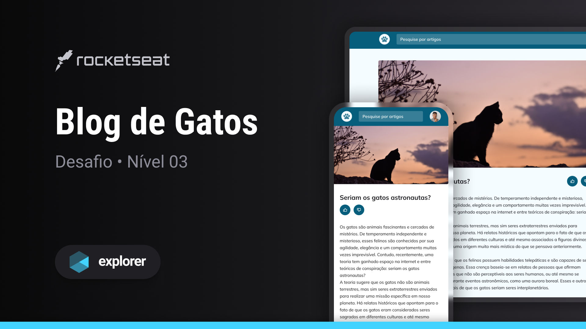
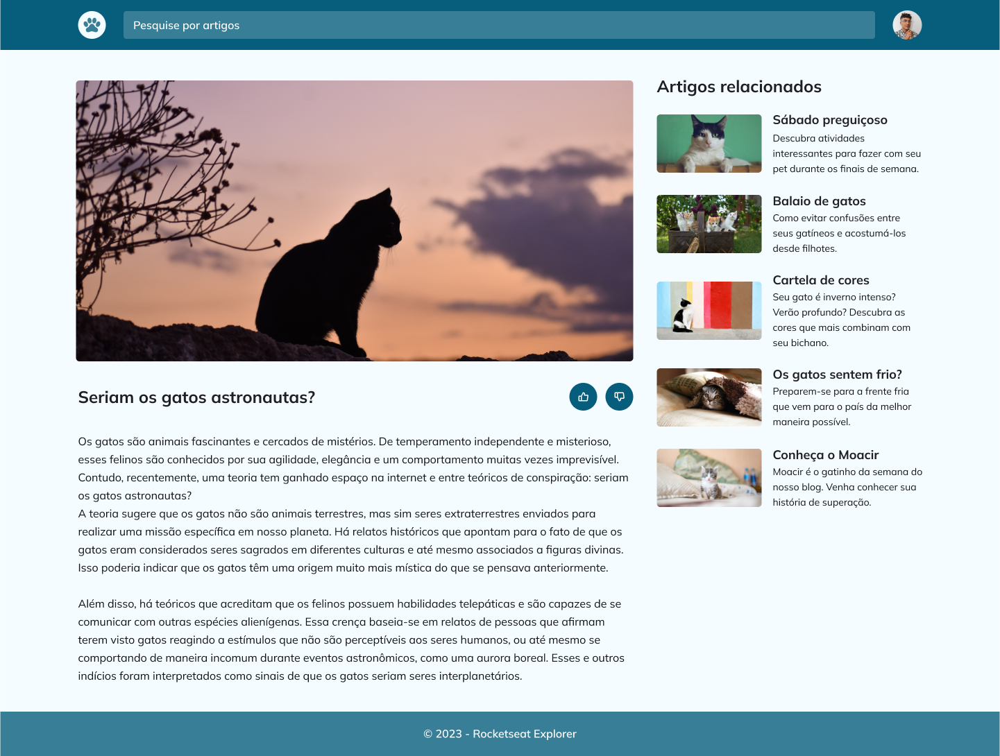

  

   
   

  

    <a href="#-projeto">Desafio</a>&nbsp;&nbsp;&nbsp;|&nbsp;&nbsp;&nbsp;
    <a href="#-tecnologias">Tecnologias</a>&nbsp;&nbsp;&nbsp;|&nbsp;&nbsp;&nbsp;
    <a href="#-layout">Layout</a>&nbsp;&nbsp;&nbsp;|&nbsp;&nbsp;&nbsp;
    <a href="#-contato">Contato</a>
  

  
  

## Sobre o desafio

Este desafio consiste em uma interface web simples, construída como parte da trilha Explorer oferecida pela Rocketseat.
O objetivo principal é praticar os conceitos fundamentais de grid. Neste desafio de projeto, foram aplicados os seguintes conceitos: 

Conceitos aplicados
* Tags semânticas aside e article
* Variáveis CSS
* Aplicação do `grid template rows`
* Exploração da propriedade `max-content` e `fr`

## Tecnologias
- HTML
- CSS
- Figma

## Layout do projeto
<table>
  <tr>
    <td></td>
    <td></td>
  </tr>   
</table>

## Demonstração
Aqui está uma prévia do resultado final do desafio desenvolvido
[Link Demonstração](https://joao-sillva.github.io/blog-de-gatos/)

## Contato
Se você tiver alguma dúvida ou quiser entrar em contato, você pode me enviar uma mensagem pelo
[LinkedIn](https://www.linkedin.com/in/joao-sillva/).

(<a href="#readme-top">voltar ao topo</a>)
